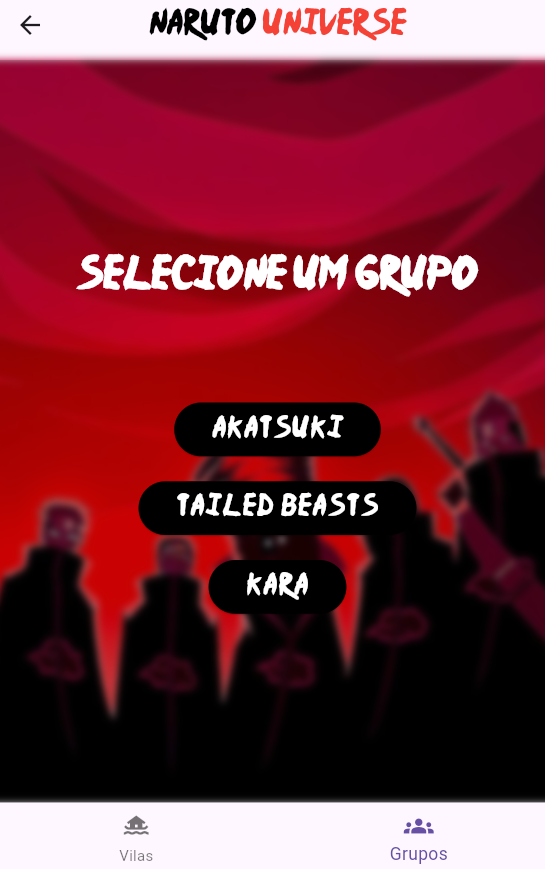

<h1 align="center"> Naruto Universe </h1>

    Projeto para a matéria de Programação Orientada a Objetos - UFRN.

  <a href="#-tecnologias">Tecnologias</a>&nbsp;&nbsp;&nbsp;|&nbsp;&nbsp;&nbsp;
  <a href="#-projeto">Projeto</a>&nbsp;&nbsp;&nbsp;|&nbsp;&nbsp;&nbsp;
  <a href="#-devs">Devs</a>&nbsp;&nbsp;&nbsp;|&nbsp;&nbsp;&nbsp;
  <a href="#-api">Api</a>&nbsp;&nbsp;&nbsp;|&nbsp;&nbsp;&nbsp;

 

    
    

## 🚀 Tecnologias

Esse projeto foi desenvolvido com as seguintes tecnologias:

- Flutter e Dart
- Git e Github
- Vscode
- Getx
- Api

## 💻 Projeto

Este projeto foi desenvolvido para a matéria de POO da faculdade (UFRN). Tem como temática a série japonesa Naruto, contendo algumas informanções
sobre os personagens do anime, servindo como uma "pokedéx".

## 🕵️ Devs

- Matheus Diniz Fernandes
- Felipe Augusto Araújo da Cunha

## 🎲 API

https://narutodb.xyz/

